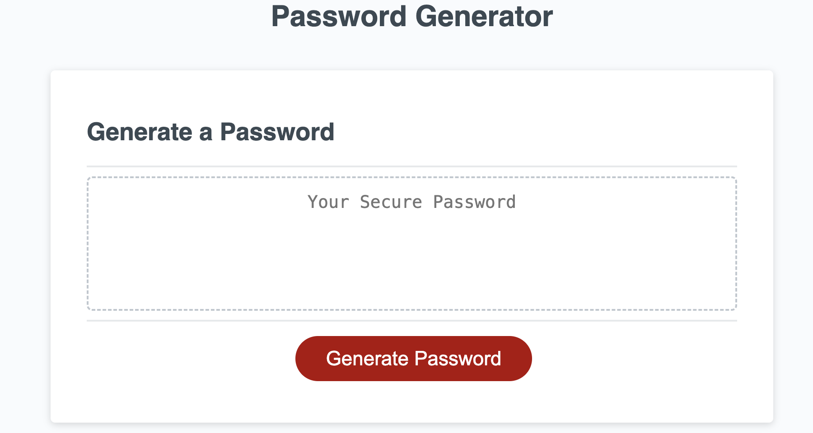
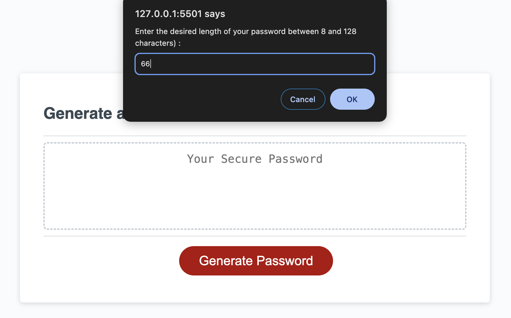
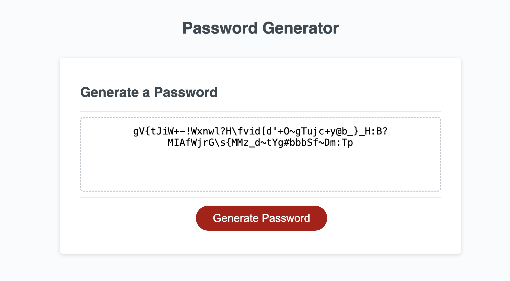

# Password Generator

This web application allows users to generate random passwords based on their chosen criteria. It runs in the browser and features a clean and polished user interface that adapts to multiple screen sizes.

## Table of Contents

- [Features](#features)
- [Instructions](#instructions)
- [Screenshots](#screenshots)
- [How to Use](#how-to-use)

## Features

- Dynamically updated HTML and CSS powered by JavaScript.
- Password criteria prompts: length, lowercase, uppercase, numeric, special characters.
- Responsive design for various screen sizes.

## Instructions

1. Click the "Generate Password" button.
2. Follow the prompts to select password criteria.
3. Password is generated and displayed on the page.

## Screenshots
## How to Use

